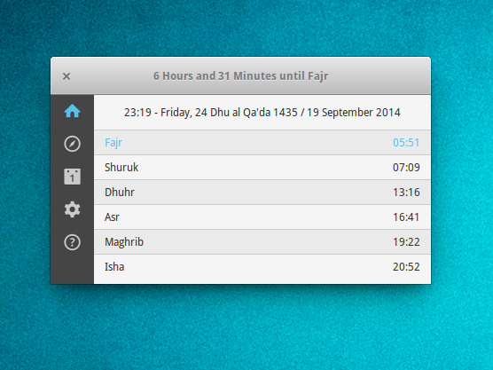

Silaty
======

A neat prayer reminder app in GTK



## Installation

### Install using debian package

Download the [package](https://github.com/AXeL-dev/Silaty/releases/download/v1.1/silaty_1.1_all.deb).

Install it using apt or any similar tool:
```bash
sudo apt install silaty_1.1_all.deb
```

### Install from source

Download or clone this repository with git:
```bash
git clone https://github.com/AXeL-dev/Silaty.git
```

Make sure that you have all the dependencies installed using the following command:
```bash
sudo apt install gir1.2-gtk-3.0 gir1.2-appindicator3-0.1 gir1.2-notify-0.7 gir1.2-gstreamer-1.0
```

**Note:** this command may change depending on your linux distribution.

To install run:
```bash
cd /path/to/silaty
sudo ./install.sh
```

Once installed, you can run Silaty from your applications menu, or using the command bellow:
```bash
silaty-indicator
```

To uninstall run:
```bash
sudo ./uninstall.sh
```

## Changelog

### v1.1

* LICENSE added.
* [Add screenshots #3](https://github.com/Jessewb786/Silaty/issues/3).
* README updated.
* attempt to clean code.
* GTK warnings fixed.
* switching between sidebar tabs from indicator menu fixed.
* about tab added/implemented into sidebar.
* fixed a crash when closing the main window.
* [Settings won't open #2](https://github.com/Jessewb786/Silaty/issues/2) fixed.
* load notification icon from its path instead of using an icon name.
* use default layout size, instead of using a fixed window size.
* refresh prayer times on home tab when changing settings.
* useless debug messages commented (especially those used in main loop).
* attempt to fix [installing error #4](https://github.com/Jessewb786/Silaty/issues/4) by ignoring pycompile cmd.
* timezone added to location settings.
* get location using Google Maps API disabled (no longer works).
* daylight saving time setting added.
* display/hide main window from indicator menu fixed.
* location search button added.
* wrong time suffix (AM/PM) when using 12h clock format fixed.
* solve some class naming conflicts.
* [Locations.xml](data/Locations.xml) updated from [libgweather](https://github.com/GNOME/libgweather) repository.
* grabbing timezone from locations xml file done.
* remaining time until next prayer corrected.

### v1.0

* first release

## ToDo

- [x] fix settings issues (especially Location settings).
- [x] use a custom list to get/set location (@see [Minbar](https://github.com/fajran/minbar)).
- [x] remove duplicate locations/cities in [Locations.xml](data/Locations.xml).
- [ ] translate to other languages.

## Credits

- [Jessewb786](https://github.com/Jessewb786)

## License

Silaty is licensed under the [GPL license](LICENSE).
